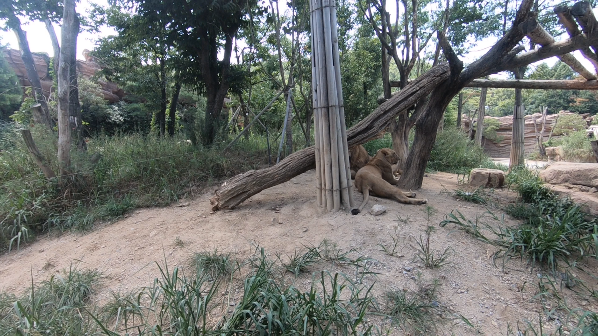
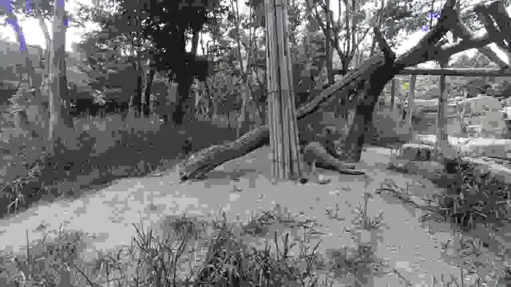

# Differentiable JPEG

[](https://github.com/ChristophReich1996/Differentiable_JPEG/blob/main/LICENSE)

Unofficial PyTorch reimplementation of the differentiable JPEG proposed
in "[JPEG-resistant Adversarial Images](https://machine-learning-and-security.github.io/papers/mlsec17_paper_54.pdf)" by
Shin and Song.

<p align="center">
    
    
</p>

**Figure:** Original image left, JPEG coded image right (compression strength is 5). Image from REDS dataset.

**This repository includes an easy-to-use pure PyTorch implementation of the differentiable JPEG.**

## Installation

The differentiable JPEG can be installed by using `pip`.

````shell script
pip install git+https://github.com/ChristophReich1996/Differentiable_JPEG
````

## Example Usage

The differentiable JPEG implementation can be simply used as a standard `nn.Module` or as a function:

````python
import torch
import torch.nn as nn
from torch import Tensor

from diff_jpeg import JPEGCoding, jpeg_coding

# Make (raw) input image
B, H, W = 2, 64, 64
image: Tensor = 255.0 * torch.rand(B, 3, H, W)
# Init compression strength ranging from [1, 99]
compression_strength: Tensor = torch.tensor([95.0])
# Init module
jpeg_module: nn.Module = JPEGCoding(differentiable=True)
# Make forward pass
image_jpeg_coded: Tensor = jpeg_module(image, compression_strength)
# Alternative use the functional implementation
image_jpeg_coded: Tensor = jpeg_coding(image, compression_strength, differentiable=True)
````

For a more detailed examples on how to use this implementation please refer to the [example](example.py) file (requires
Matplotlib and torchvision to be installed).

## Reference

````bibtex
@inproceedings{Shin2017,
    title={{Jpeg-resistant Adversarial Images}},
    author={Shin, Richard and Song, Dawn},
    booktitle={{NIPS 2017 Workshop on Machine Learning and Computer Security}},
    volume={1},
    pages={8},
    year={2017}
}
````

Toy image from REDS dataset

````bibtex
@inproceedings{Nah2019,
    author={Nah, Seungjun and Baik, Sungyong and Hong, Seokil and Moon, Gyeongsik and Son, Sanghyun and Timofte, Radu and Lee, Kyoung Mu},
    title={{NTIRE 2019 Challenge on Video Deblurring and Super-Resolution: Dataset and Study}},
    booktitle={{CVPRW}},
    month={June},
    year={2019}
}
````
